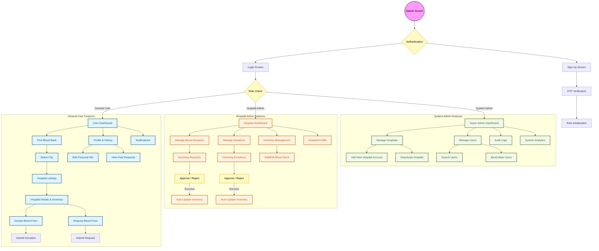

# Project Charter: Blood Bank Finder and Donation Management System

## Project Overview

| Project Title | Blood Bank Finder and Donation Management System |
| :--- | :--- |
| **Proponents** | Elvira A. Medio (Programmer/Coder) |
| **Instructors** | Mr. Panfilo Remedio, Mrs. Annalyn P. Gelicame, LPT |
| **Date** | March 23, 2021 |

---

## 1. Project Description
The **Blood Bank Finder Mobile Application** is designed to connect blood donors, patients, hospitals, and administrators in one centralized system. It allows users to search for available blood banks, donate blood, or request blood. It streamlines communication between donors and hospitals while allowing administrators to manage requests, users, and hospital records efficiently through a role-based system.

---

## 2. Project Scope
The system focuses on providing a mobile-based solution for blood donation and blood request management. 
- **In-Scope:** User registration and authentication, hospital listings, blood request processing, donation approvals, and administrative monitoring. Mobile access for general users, system administrators, and hospital administrators.
- **Out-of-Scope:** Direct medical processing, physical blood storage management hardware, or integration with external government health databases.

---

## 3. System Features
- **User Registration and Login:** Secure authentication via Firebase Authentication.
- **Role-based Access Control:** Distinct interfaces and permissions for **General Users**, **Hospital Admins**, and **System Admins**.
- **Search Functionality:** Search for hospitals by city to check blood availability.
- **Form Submissions:** Dedicated forms for Blood Donation and Blood Request.
- **Approval System:** Workflow for hospital administrators to review, approve, or reject requests.
- **Notification System:** Real-time push notifications for request status updates.
- **Admin Dashboard:** Centralized panel for managing hospital accounts, users, and system-wide activity.
- **Real-time Database:** Synchronized data updates using Firebase Firestore.

---

## 4. System Users

### General Users (Mobile)
- Register and log in.
- Search blood banks by city.
- View hospital details and blood inventory.
- Submit blood donation and blood request forms.
- Receive real-time approval or rejection notifications.
- View profile and personal request history.

### System Admin (Mobile)
- Manage hospital accounts (Add/Delete).
- Manage user accounts (View, Ban, Monitor).
- Monitor all blood requests and donations system-wide.
- View system activity reports and analytics.

### Hospital Admin
- Log in to the dedicated hospital management panel.
- View and process incoming blood requests and donation offers.
- Approve or reject requests based on inventory.
- Update real-time blood inventory levels.
- Manage hospital profile information.
- Track history of pending, approved, and rejected requests.

---

## 5. Limitations
- **Connectivity:** Requires a stable internet connection to function.
- **Dependency:** Heavily dependent on Firebase services (Auth, Firestore, Messaging).
- **Data Accuracy:** Blood availability data is dependent on timely updates from hospital administrators.
- **No GPS Integration:** No direct real-time GPS tracking for users or blood transport.
- **Restricted Access:** Limited to hospitals registered within the system.

---

## 6. Risks
- **Security:** Potential data privacy risks if security rules are not strictly configured.
- **Data Integrity:** Risk of false information or fraudulent requests submitted by users.
- **Availability:** System downtime if Firebase cloud services experience outages.
- **Latency:** Potential for delayed responses from hospital administrators in critical situations.
- **Misuse:** Potential for misuse of the emergency request features.

---

## 7. Alternative Solutions
- Manual hospital hotline or telephone-based coordination.
- SMS-based blood request and broadcast system.
- Integration with existing third-party health management systems.
- Development of a web-based admin panel for easier desk-based management.
- Integration with a government-centralized national blood database.

---

## 8. Advantages
- **Efficiency:** Significantly faster processing of blood requests compared to manual methods.
- **Centralization:** Digital record management eliminates paper-based tracking errors.
- **Transparency:** Real-time updates on request status for all stakeholders.
- **Enhanced Communication:** Direct link between donors and hospitals.
- **Monitoring:** Streamlined oversight for system administrators.
- **Accessibility:** 24/7 access via mobile devices.

---

## 9. System Flow (Mobile)
1. **Launch:** User opens the app (Splash Screen).
2. **Auth:** User selects Login or Sign Up.
3. **Home:** After authentication, the user enters the main dashboard.
4. **Functional Paths:**
   - **Find Blood Bank:** Select City → View Hospitals → View Details.
   - **Donate Blood:** Fill Form → Submit → Hospital Review → Approve/Reject → User Notification.
   - **Request Blood:** Fill Form → Submit → Hospital Review → Approve/Reject → User Confirmation.
   - **Hospital Management:** Admin logs in → Reviews Requests → Updates Inventory.
   - **System Oversight:** System Admin logs in → Manages Entities → Monitors Reports.

### Comprehensive System Flowchart

---

## 10. Approval

**Approved by:**

| Name | Signature | Date |
| :--- | :--- | :--- |
| **Mr. Panfilo Remedio** (Instructor) | ____________________ | ____________________ |
| **Mrs. Annalyn P. Gelicame, LPT** (Instructor) | ____________________ | ____________________ |
